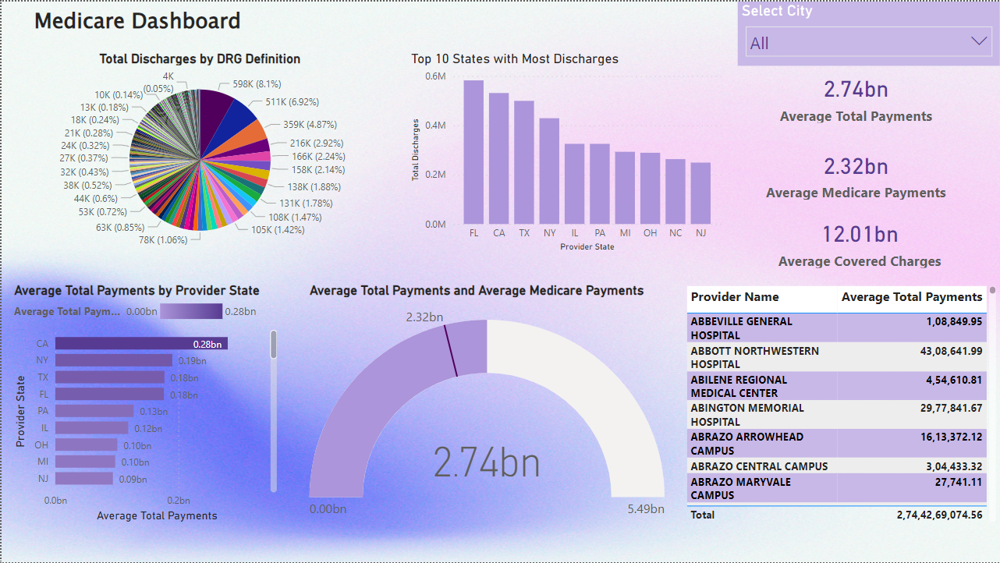

# Power BI Medicare Dashboard

## Overview

This repository contains a Power BI Medicare Dashboard that provides insights into Healthcare data. The dashboard is designed to help users visualize and analyze patient discharges, track key metrics, and make data-driven decisions.

## Table of Contents

- [Overview](#overview)
- [Features](#features)
- [License](#license)

## Features

- Visualizations of medicare data, including charts, tables, and graphs.
- Interactive filters for slicing and dicing data.
- Drill-through functionality for deeper analysis.
- Data-driven insights to help make informed decisions.

## License

This project is licensed under the MIT License - see the [LICENSE](LICENSE) file for details. All data sources are open source from Kaggle.
